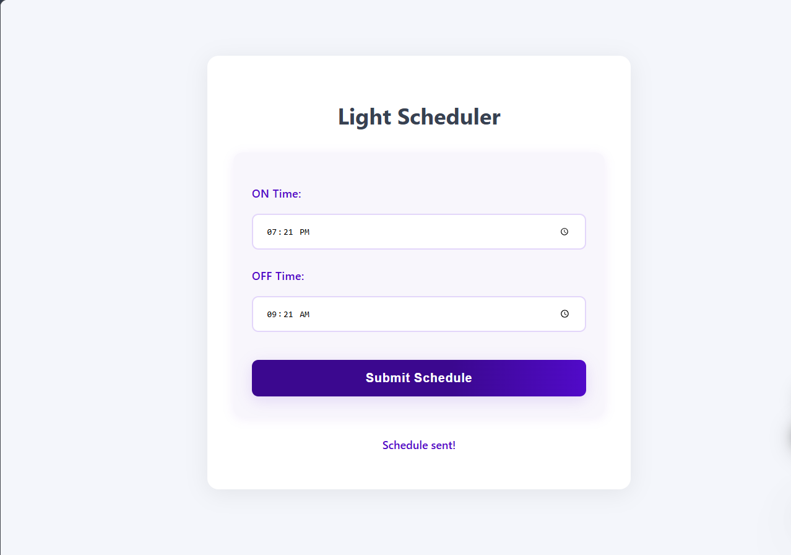

# Web-Based Light Scheduler


A full-stack IoT dashboard to schedule a light using a graphical web interface, WebSocket, MQTT, and Arduino.

---

## Features
- **Web UI:** Schedule ON/OFF times for a light.
- **WebSocket Server:** Receives schedule from browser, forwards to MQTT.
- **MQTT Subscriber:** Receives schedule, sends ON/OFF command to Arduino via serial.
- **Arduino:** (Not included) Acts on serial input to control relay.

---

## Folder Structure
```
frontend/
  index.html      # Main web page
  style.css       # Stylesheet
  main.js         # WebSocket logic
backend/
  websocket_server.py   # WebSocket to MQTT bridge
  mqtt_serial_bridge.py # MQTT to Serial (Arduino) bridge
requirements.txt  # Python dependencies
```

---

## Setup Instructions

### 1. Prerequisites
- Python 3.8+
- Mosquitto MQTT broker (`mosquitto_pub`, `mosquitto_sub`)
- Arduino UNO (already programmed for serial relay control)
- Node.js (optional, for serving frontend)

### 2. Install Python Dependencies
```
pip install -r requirements.txt
```

### 3. Start Mosquitto Broker
```
mosquitto
```

### 4. Run the WebSocket Server
```
cd backend
python websocket_server.py
```

### 5. Run the MQTT-Serial Bridge
- Edit `SERIAL_PORT` in `mqtt_serial_bridge.py` to match your Arduino's COM port (e.g., `COM3` on Windows).
> **Note:** If you are using Windows, check your Arduino's COM port in Device Manager and update `SERIAL_PORT` in `backend/mqtt_serial_bridge.py` accordingly.
```
python mqtt_serial_bridge.py
```

### 6. Open the Frontend
- Open `frontend/index.html` in your browser (or serve with a simple HTTP server).

---

## Example UI

---

## How it Works
1. User sets ON/OFF times in the browser and clicks Submit.
2. The schedule is sent via WebSocket to the Python backend.
3. Backend forwards the schedule to MQTT topic `light/schedule`.
4. The MQTT-Serial bridge subscribes to this topic, checks schedule against current time, and sends ON (`1`) or OFF (`0`) to Arduino via serial.
5. Arduino acts on serial input to control the relay.

---

## Demo GIF
_Add a GIF here showing the full workflow (browser → Arduino)_

---

## Contact
arnwolfie5@gmail.com

---

## License
MIT
